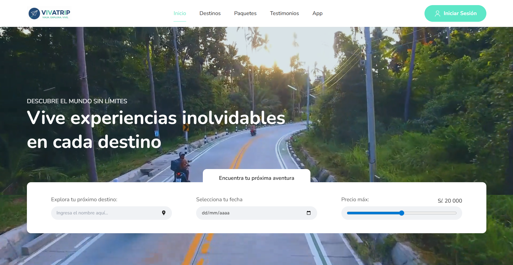

# ✈️ VIVA TRIP · Descubre el mundo 🌍

[](https://viva-trip-kohl.vercel.app/)

Bienvenido a **Viva Trip**, tu compañero digital para explorar los destinos más extraordinarios del mundo, donde creemos que cada viaje es una **historia por vivir, una cultura por descubrir y una aventura por recordar**.
Con un diseño moderno, intuitivo y completamente responsive, **Viva Trip** te conecta con experiencias únicas, paquetes turísticos exclusivos y destinos que inspirarán tu próxima escapada. 🗺️✨

---

## 🌟 Características Principales

- 🏔️ **Carrusel de destinos destacados** con los lugares más fascinantes del planeta.
- 🎫 **Paquetes turísticos todo incluido**, desde castillos europeos hasta playas paradisíacas.
- 🎨 **Diseño limpio y moderno**, optimizado con Tailwind CSS.
- 📱 **Totalmente responsive**, adaptado a móviles, tablets y escritorio.
- ✨ **Animaciones fluidas con React Slick**, que aportan dinamismo a la experiencia.
- 🚀 **Rendimiento optimizado con Next.js 16**, garantizando velocidad y fluidez.

---

## ❓ ¿Por qué Viva Trip?

El nombre **Viva Trip** refleja nuestra filosofía:

- **Viva** = Vive intensamente cada momento de tus viajes.
- **Trip** = Cada destino es un viaje único hacia nuevas experiencias.

Nuestro objetivo es **inspirarte a explorar el mundo** con una plataforma que combine información útil, diseño atractivo y experiencias inolvidables.

---

## 🛠️ Tecnologías Utilizadas 👨‍💻

| HTML | CSS | JavaScript | React | TypeScript | Tailwind CSS | Next.js | Node.js |
|------|-----|------------|--------|-------------|---------------|--------|---------|
|  |  |  |  |  |  |  |  |

**Librerías adicionales:**
- 🎠 **React Slick** - Carruseles interactivos
- 🎯 **React Icons** - Iconografía moderna
- 🖼️ **Next/Image** - Optimización de imágenes

---

## 🚀 Instalación y Uso Local

Sigue estos pasos para clonar y ejecutar el proyecto en tu máquina local:

1. **Clona el repositorio:**

```bash
   git clone https://github.com/carlossilvadev10/viva-trip.git
```

2. **Entra en el directorio del proyecto:**
```bash
   cd viva-trip
```

3. **Instala las dependencias necesarias:**
```bash
   npm install
```

4. **Ejecuta la aplicación en entorno de desarrollo:**
```bash
   npm run dev
```

5. **Abre tu navegador y visita:**
```bash
   http://localhost:3000
```

---

## 📩 Contacto

Si tienes alguna pregunta o sugerencia, puedes encontrarme en:

- 🌐 [Mi GitHub](https://github.com/carlossilvadev10)
- 📧 Email: [carlos.esilva1007@gmail.com](mailto:carlos.esilva1007@gmail.com)
- 💼 [Mi LinkedIn](https://www.linkedin.com/in/carlos-eduardo-silva-bustamante-b6084528b)

---

💡 **Viva Trip** es más que una agencia de viajes: Es una **invitación a vivir experiencias que transforman** y a descubrir el mundo con **pasión y propósito**.

🌍 **¡Tu próxima aventura comienza aquí!** ✈️